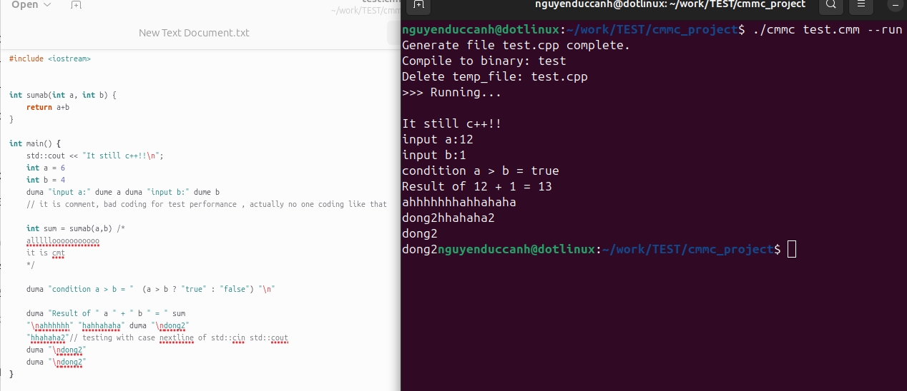
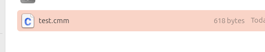

# C-- (C Minus Minus) A FUNNY PROJECT OF C++

**C-- (C minus minus)** is an experimental open-source project inspired by C++.
The goal is to simplify syntax and common operations, making the language more beginner-friendly while reducing common errors such as missing semicolons.

---

## Overview
C-- keeps the power of C++ but tries to remove unnecessary complexity. 
The project is currently in **beta**, so bugs are expected. Feedback and contributions from the community are welcome.

---

## Features
- Simplified syntax based on C++.
- Some common mistakes (like missing `;`) are tolerated.
- Open for community contribution and improvements.

---

## Usage
The compiler auto translates `.cmm` files into `.cpp`, then builds them into executables.

###Easy to use with this syntax:
```
./cmmc input.cmm [--run] [--keep-cpp]
```
###Options:
- `--keep-cpp`: keep the generated `.cpp` file.
- `--run`: run the compiled binary immediately.
###Note:
./cmmc : for linux
./cmmc.exe : for window

###Self build: 
- Linux 
```
g++ cmmc.cpp -o cmmc
```
```
x86_64-w64-mingw32-g++ cmmc.cpp -o cmmc.exe -static-libgcc -static-libstdc++
```
(Cross-compile for Windows)
- Window
```
g++ cmmc.cpp -o cmmc.exe
```
---

## Screenshots / Demonstration



---

## Contributing
This project is **open source** and welcomes:
- Bug reports
- Feature suggestions
- Pull requests for improvements

---

## License

-This project is licensed under the [MIT License](https://opensource.org/licenses/MIT).


